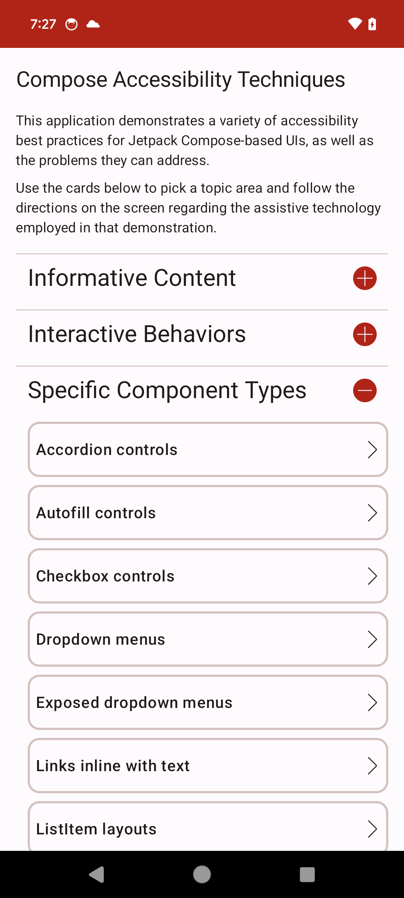
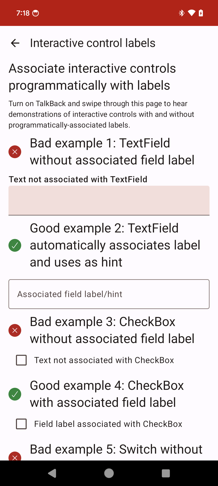

# android-compose-accessibility-techniques

Demonstrates a variety of accessibility best practices for Android Jetpack Compose-based UIs, as well as the problems they can address.
Using the app will demonstrate the impact of accessibility best practices, and reviewing the app project source code will help you learn how to apply those techniques in working code.

See [android-compose-accessibility-techniques Architecture](ARCHITECTURE.md) for details of the app architecture and the project's file structure.

Since some of the code demonstrates the effect of inaccessible coding practices, the app itself does not fully conform to required accessibility guidelines.

## Topics
- Informative Content
    - [x] [Text alternatives](doc/content/TextAlternatives.md)
    - [x] [Accessibility traversal order](doc/content/AccessibilityTraversalOrder.md)
    - [x] [Content grouping](doc/content/ContentGrouping.md)
    - [x] [Content group replacement](doc/content/ContentGroupReplacement.md)
    - [x] [Heading semantics](doc/content/HeadingSemantics.md)
    - [x] [List semantics](doc/content/ListSemantics.md)
    - [x] [Adaptive layouts](doc/content/AdaptiveLayouts.md)
    - [x] [Dark and Light themes](doc/content/DarkAndLightThemes.md)
    - [x] [Screen and pane titles](doc/content/ScreenAndPaneTitles.md)
- Interactive Behaviors
    - [x] [Interactive control labels](doc/interactions/InteractiveControlLabels.md)
    - [x] [Minimum touch target size](doc/interactions/MinimumTouchTargetSize.md)
    - [x] [UX change announcements](doc/interactions/UXChangeAnnouncements.md)
    - [x] [Keyboard types and options](doc/interactions/KeyboardTypes.md)
    - [x] [Keyboard actions](doc/interactions/KeyboardActions.md)
    - [x] [Keyboard focus order](doc/interactions/KeyboardFocusOrder.md)
    - [x] [Custom focus indicators](doc/interactions/CustomFocusIndicators.md)
    - [x] [Custom click labels](doc/interactions/CustomClickLabels.md)
    - [x] [Custom state descriptions](doc/interactions/CustomStateDescriptions.md)
    - [x] [Custom accessibility actions](doc/interactions/CustomAccessibilityActions.md)
    - [x] [Scrolling columns](doc/interactions/ScrollingColumns.md)
- Specific Component Types
    - [x] [Accordion controls](doc/components/AccordionControls.md)
    - [x] [Autofill controls](doc/components/AutofillControls.md)
    - [x] [Checkbox controls](doc/components/CheckboxControls.md)
    - [x] [Dropdown menus](doc/components/DropdownMenus.md)
    - [x] [Exposed dropdown menus](doc/components/ExposedDropdownMenus.md)
    - [x] [Links inline with text](doc/components/LinksInlineWithText.md)
    - [x] [ListItem layouts](doc/components/ListItemLayouts.md)
    - [x] [ModalBottomSheet layouts](doc/components/ModalBottomSheetLayouts.md)
    - [x] [NavigationBar layouts](doc/components/NavigationBarLayouts.md)
    - [x] [Pop-up messages (Toast, SnackBar, and AlertDialog controls)](doc/components/PopupMessages.md)
    - [x] [RadioButton groups](doc/components/RadioButtonGroups.md)
    - [x] [Slider and RangeSlider controls](doc/components/SliderAndRangeSliderControls.md)
    - [x] [Stand-alone links](doc/components/StandAloneLinks.md)
    - [x] [Switch controls](doc/components/SwitchControls.md)
    - [x] [Tab rows](doc/components/TabRows.md)
    - [x] [TextField controls](doc/components/TextFieldControls.md)
    
- Other
    - [x] [Compose Semantics automated testing](doc/AutomatedComposeAccessibilityTesting.md)

## Accessibility static analysis tools

This project includes static analysis tools and an IDE plugin for detecting Compose accessibility issues:

### A11yAgent (a11y-check-android)

A standalone CLI tool with **32 rules** mapped to WCAG 2.2 criteria, WCAG scoring (0-100), trend tracking, baseline suppression, and multiple output formats (terminal, JSON, HTML, SARIF, Gradle). Runs on-demand via `./gradlew a11yCheck` with clickable results in Android Studio's Build tab.

```bash
./gradlew a11yCheck                    # Run check + generate HTML report
java -jar A11yAgent/build/libs/a11y-check-android-0.1.0.jar app/src/main/java  # Run directly
```

See [`A11yAgent/README.md`](A11yAgent/README.md) for full documentation.

### Custom Android Lint rules (lint-checks)

A custom Lint module with **32 rules** that integrate into Android's built-in Lint system. Shows **real-time squiggly underlines** in the Android Studio editor and appears in `./gradlew lint` HTML reports alongside standard Lint checks. Works behind any corporate proxy with zero external downloads.

See [`lint-checks/README.md`](lint-checks/README.md) for details.

### IDE Plugin (IntelliJ / Android Studio)

An IntelliJ Platform plugin (`ide-plugin/`) that shows **real-time inline accessibility warnings** in the editor as you type — squiggly underlines with hover tooltips showing WCAG criteria and fix suggestions. Powered by the same 32-rule a11y-check-android engine.

**Install from disk:**
```bash
./gradlew :A11yAgent:shadowJar          # Build the analysis engine first
cd ide-plugin && ./gradlew buildPlugin  # Build the plugin zip
```
Then in Android Studio: **Settings > Plugins > gear icon > Install Plugin from Disk** — select `ide-plugin/build/distributions/compose-accessibility-checker-0.3.0.zip` and restart. Supports **Alt+Enter quick-fixes** for 6 rules with auto-fix support.

**Install from JetBrains Marketplace** (once published): **Settings > Plugins > Marketplace** — search "Compose Accessibility Checker".

See [`ide-plugin/README.md`](ide-plugin/README.md) for full documentation including corporate proxy setup and publishing instructions.

### Gradle Plugin

A Gradle plugin (`gradle-plugin/`) for easy integration into any Android project:

```groovy
// settings.gradle
includeBuild 'gradle-plugin'

// app/build.gradle
plugins { id 'com.cvshealth.a11y' }
a11y {
    minScore = 70
    format = 'gradle'
    paths = ['src/main/java']
}
```

Run `./gradlew a11yCheck` to analyze your project. See [`gradle-plugin/`](gradle-plugin/) for details.

### Pre-commit Hook

A git pre-commit hook (`.githooks/`) that checks staged `.kt` files for accessibility errors before each commit:

```bash
bash .githooks/install-hooks.sh   # One-time setup
```

Errors block the commit; warnings are informational. Skip with `git commit --no-verify`.

## Screenshots



## Contributor Guide

1. Before contributing to this CVS Health sponsored project, you will need to sign the associated [Contributor License Agreement](https://forms.office.com/r/9e9VmE7qLW).
2. See the [contributing](CONTRIBUTING.md) page.

## License
android-compose-accessibility-techniques is licensed under under the Apache License, Version 2.0.  See [LICENSE](LICENSE) file for more information.

Copyright 2023-2025 CVS Health and/or one of its affiliates

Licensed under the Apache License, Version 2.0 (the "License");
you may not use this file except in compliance with the License.
You may obtain a copy of the License at

http://www.apache.org/licenses/LICENSE-2.0

Unless required by applicable law or agreed to in writing, software
distributed under the License is distributed on an "AS IS" BASIS,
WITHOUT WARRANTIES OR CONDITIONS OF ANY KIND, either express or implied.

See the License for the specific language governing permissions and
limitations under the License.
